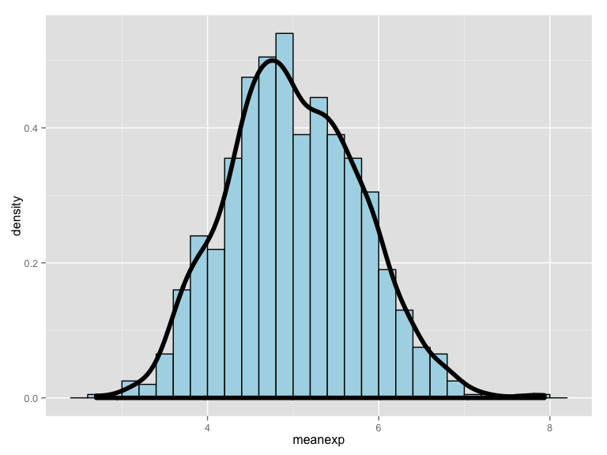

# Comparing the exponential distribution in R with the Central Limit Theorem
Alexander Pyle, <apyle@github.com>  
December 27, 2015  

 A sample set of headings that could be used to guide the creation of your report might be:

    (DONE) Title (give an appropriate title) and Author Name
    (DONE) Overview: In a few (2-3) sentences explain what is going to be reported on.
    Simulations: Include English explanations of the simulations you ran, with the accompanying R code. Your explanations should make clear what the R code accomplishes.
    Sample Mean versus Theoretical Mean: Include figures with titles. In the figures, highlight the means you are comparing. Include text that explains the figures and what is shown on them, and provides appropriate numbers.
    Sample Variance versus Theoretical Variance: Include figures (output from R) with titles. Highlight the variances you are comparing. Include text that explains your understanding of the differences of the variances.
    Distribution: Via figures and text, explain how one can tell the distribution is approximately normal. 
    
## Overview

The Central Limit Theorem (CLT) posits that the distribution of averages of 
independent and identically distributed (iid) variables randomly drawn from a 
population becomes that of a standard normal as the sample size increases. This 
analysis tests this theorem and determines that it holds true for mean and the 
variance. That is to say, the sample mean will converge to the population mean 
as the number of iid varables averaged together increases, and that the variance 
of these averages will converge to the population variance.


```r
# load required libraries
library(data.table)
library(ggplot2)

set.seed(90125) # seed the random number generator for reproducible results

lambda = 0.2    # given by assignment
samples = 40    # number of samples to use for the mean
simulations = 1000      # number of simulations to run

meanexp = NULL
for (i in 1 : simulations) 
        meanexp = c(meanexp, mean(rexp(samples, lambda)))
hist (meanexp)
```


```r
meanDF <- as.data.frame(meanexp)

g <- ggplot(data = meanDF, aes(x = meanexp)) 
g <- g + geom_histogram(aes(y = ..density..), fill = "lightblue", binwidth=0.2, colour = "black")
g <- g + geom_density(size = 2, colour = "black")
g
```



```r
# nosim <- 1000
# cfunc <- function(x, n) sqrt(n) * (mean(x) - 0.9) / sqrt(.1 * .9)
# dat <- data.frame(
#         x = c(apply(matrix(sample(0:1, prob = c(.1,.9), nosim * 10, replace = TRUE), 
#                            nosim), 1, cfunc, 10),
#               apply(matrix(sample(0:1, prob = c(.1,.9), nosim * 30, replace = TRUE), 
#                            nosim), 1, cfunc, 30),
#               apply(matrix(sample(0:1, prob = c(.1,.9), nosim * 50, replace = TRUE), 
#                            nosim), 1, cfunc, 50)
#         ),
#         size = factor(rep(c(10, 30, 50), rep(nosim, 3))))
# g <- ggplot(dat, aes(x = x, fill = size)) + geom_histogram(binwidth=.3, colour = "black", aes(y = ..density..)) 
# g <- g + stat_function(fun = dnorm, size = 2)
# g + facet_grid(. ~ size)
```

## Appendix


```r
library(devtools)
```

```
## Warning: package 'devtools' was built under R version 3.1.3
```

```r
session_info() # display environment the script was create and run in.
```

```
## Session info --------------------------------------------------------------
```

```
##  setting  value                       
##  version  R version 3.1.2 (2014-10-31)
##  system   x86_64, darwin10.8.0        
##  ui       X11                         
##  language (EN)                        
##  collate  en_US.UTF-8                 
##  tz       America/Denver
```

```
## Packages ------------------------------------------------------------------
```

```
##  package    * version  date       source                            
##  colorspace   1.2-4    2013-09-30 CRAN (R 3.1.0)                    
##  data.table * 1.9.2    2014-02-27 CRAN (R 3.1.0)                    
##  devtools   * 1.8.0    2015-05-09 CRAN (R 3.1.3)                    
##  digest       0.6.4    2013-12-03 CRAN (R 3.1.0)                    
##  evaluate     0.5.5    2014-04-29 CRAN (R 3.1.0)                    
##  formatR      1.0      2014-08-25 CRAN (R 3.1.1)                    
##  ggplot2    * 1.0.0    2014-05-21 CRAN (R 3.1.0)                    
##  git2r        0.10.1   2015-05-07 CRAN (R 3.1.3)                    
##  gtable       0.1.2    2012-12-05 CRAN (R 3.1.0)                    
##  htmltools    0.2.6    2014-09-08 CRAN (R 3.1.1)                    
##  knitr        1.8      2014-11-11 CRAN (R 3.1.2)                    
##  labeling     0.3      2014-08-23 CRAN (R 3.1.1)                    
##  MASS         7.3-35   2014-09-30 CRAN (R 3.1.2)                    
##  memoise      0.2.1    2014-04-22 CRAN (R 3.1.0)                    
##  munsell      0.4.2    2013-07-11 CRAN (R 3.1.0)                    
##  plyr         1.8.1    2014-02-26 CRAN (R 3.1.0)                    
##  proto        0.3-10   2012-12-22 CRAN (R 3.1.0)                    
##  Rcpp         0.11.3   2014-09-29 CRAN (R 3.1.1)                    
##  RCurl        1.95-4.3 2014-07-29 CRAN (R 3.1.1)                    
##  reshape2     1.4.1    2014-12-06 CRAN (R 3.1.2)                    
##  rmarkdown    0.3.10   2015-01-18 Github (rstudio/rmarkdown@b96214b)
##  rversions    1.0.0    2015-04-22 CRAN (R 3.1.3)                    
##  scales       0.2.4    2014-04-22 CRAN (R 3.1.0)                    
##  stringr      0.6.2    2012-12-06 CRAN (R 3.1.0)                    
##  XML          3.98-1.1 2013-06-20 CRAN (R 3.1.0)                    
##  yaml         2.1.13   2014-06-12 CRAN (R 3.1.0)
```


```r
#More potentially useful code:
#
#---
#title: "Testing chunk reuse"
#author: "Neil Saunders"
#date: "24/02/2015"
#output: html_document
#---
# 
### Introduction
#Here is my very interesting document.
# 
#Chunk 1 is calling chunk 2 here, but you can't see it.
#```{r chunk1, ref.label="chunk2", echo=FALSE}
#```
# 
### This chunk is unnamed but can now use code from chunk 2
#```{r}
#myFunction(7)
#```
# 
### This is chunk 2
#My long and ugly R function is now down here.
# 
#```{r chunk2}
## it's not really long and ugly
## it just squares the input
## but imagine that it is long and ugly
# 
#myFunction <- function(x) {
#  print(x ^ 2)
#}
#```
```

